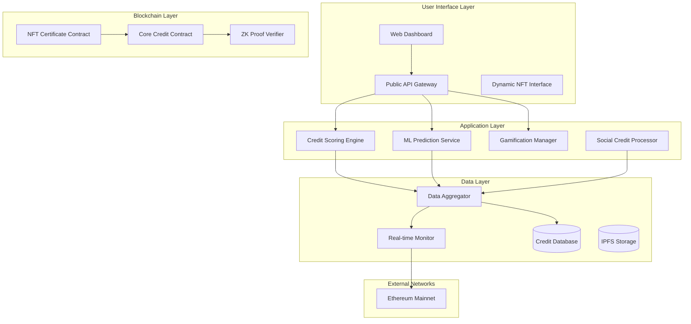

# CryptoVault Credit Intelligence - Design Document

## Overview

CryptoVault Nexus represents a paradigm shift in DeFi credit assessment, implementing a **Decentralized Autonomous Credit Organization (DACO)** that operates as a living financial intelligence network. The system employs **Quantum Credit Theory** where credit scores exist in dynamic states, adapting to context, market conditions, and behavioral patterns in real-time.

This **Financial DNA Sequencer** maps the complete behavioral genome of every DeFi participant on Ethereum mainnet, creating a **Neural Network of Trust** that connects every wallet, transaction, and financial decision into a unified intelligence system.


### Core Design Philosophy

The architecture follows three fundamental principles:

1. **Modularity**: Each component operates independently while contributing to the unified intelligence
2. **Privacy-First**: Zero-knowledge proofs ensure creditworthiness verification without data exposure
3. **Evolutionary Intelligence**: Machine learning models continuously improve through community feedback and market data

### System Goals

- Provide multi-dimensional credit assessment across 5 distinct behavioral categories
- Enable comprehensive Ethereum mainnet behavior aggregation with 15-minute detection SLA
- Deliver predictive risk analytics with 70% minimum confidence thresholds
- Maintain user privacy through zero-knowledge cryptographic proof systems
- Create gamified incentives that promote healthy financial behaviors
- Support real-time score updates within 4-hour SLA for positive behaviors
- Provide 2-second API response times for DeFi protocol integration

## Architecture

### High-Level System Architecture



### Design Decision Rationales

**Hybrid On-Chain/Off-Chain Architecture**: 
- *Rationale*: Balances decentralization with performance requirements. Critical trust operations remain on-chain while computationally intensive ML operations occur off-chain.
- *Trade-off*: Slight centralization risk for improved user experience and cost efficiency.

**Ethereum-Exclusive Design**:
- *Rationale*: Ethereum mainnet hosts the majority of DeFi protocols and provides the richest, most mature dataset for credit analysis. Focusing exclusively on Ethereum ensures data consistency and reduces complexity.
- *Implementation*: Deep integration with Ethereum mainnet only for comprehensive behavior tracking and analysis, with 15-minute transaction detection SLA.

**Zero-Knowledge Privacy Layer**:
- *Rationale*: Privacy is fundamental to financial sovereignty; users must control their data exposure.
- *Technical Choice*: zk-SNARKs for score verification, allowing proof of creditworthiness without revealing transaction details.

## Components and Interfaces

### 1. Credit Scoring Engine

**Purpose**: Calculates and maintains the five-dimensional credit scores for all users.

**Core Responsibilities**:
- Multi-dimensional score calculation (DeFi Reliability, Trading Consistency, Staking Commitment, Governance Participation, Liquidity Provider)
- Weighted algorithm application specific to each behavioral category
- Score normalization across different protocols on Ethereum
- Confidence interval calculation for each dimension
- **Insufficient Data Handling**: Clear marking of dimensions as "Insufficient Data" rather than assigning default scores when data is inadequate

**Key Interfaces**:
```solidity
interface ICreditScoringEngine {
    function calculateCreditProfile(address user) external view returns (CreditProfile memory);
    function updateScoreDimension(address user, ScoreDimension dimension, uint256 newData) external;
    function getCreditHistory(address user, uint256 timeRange) external view returns (ScoreHistory[] memory);
    function getScoreConfidence(address user, ScoreDimension dimension) external view returns (uint256);
}
```

**Data Processing Flow**:
1. Aggregate Ethereum mainnet transaction data
2. Apply dimension-specific weighting algorithms
3. Calculate confidence intervals based on data sufficiency
4. Update user credit profile with new scores within 4-hour SLA
5. Trigger NFT metadata updates if significant changes occur

### 2. Ethereum Data Aggregator

**Purpose**: Collects, normalizes, and processes financial behavior data from Ethereum mainnet.

**Technical Implementation**:
- Event listeners for Ethereum mainnet
- USD normalization service using Chainlink price feeds
- Data validation and anomaly detection
- Integration with major DeFi protocols (Uniswap, Aave, Compound, MakerDAO)
- **Wallet Linking System**: Allows users to connect multiple Ethereum wallets for unified credit profiles

**Key Features**:
- 15-minute transaction detection SLA
- Automatic USD conversion using Chainlink price feeds
- Wallet linking system for unified user profiles
- Historical data backfilling for new users

### 3. ML Prediction Service

**Purpose**: Generates predictive risk analytics using machine learning models trained on historical DeFi behavior patterns.

**Model Architecture**:
- **Time Series Models**: LSTM networks for 30/90/180-day risk predictions
- **Market Context Models**: Incorporate volatility indices and market sentiment
- **Ensemble Methods**: Combine multiple models for improved accuracy
- **Confidence Scoring**: Quantify prediction reliability with **mandatory 70% minimum confidence threshold**
- **Uncertainty Handling**: Display confidence intervals and uncertainty warnings when predictions fall below 70% confidence

**Training Data Sources**:
- Historical default patterns from DeFi lending protocols
- Market volatility correlations
- Behavioral pattern analysis
- Cross-protocol risk indicators

### 4. Privacy Verification System

**Purpose**: Enables privacy-preserving credit verification using zero-knowledge proofs.

**ZK-SNARK Implementation**:
```
Circuit Design:
- Public Inputs: Credit score threshold, verification request ID
- Private Inputs: Actual credit scores, transaction history
- Output: Boolean proof of score validity above threshold
```

**Privacy Modes**:
- **Full Privacy**: Complete transaction history remains private
- **Selective Disclosure**: Users choose which dimensions to reveal
- **Threshold Proofs**: Prove score above certain level without revealing exact value

### 5. Dynamic NFT Certificate System

**Purpose**: Represents user credit intelligence as evolving NFT certificates with real-time updates.

**NFT Metadata Structure**:
```json
{
  "name": "CryptoVault Credit Certificate",
  "description": "Dynamic credit intelligence representation",
  "image": "ipfs://[generated-based-on-scores]",
  "attributes": [
    {"trait_type": "DeFi Reliability", "value": 850},
    {"trait_type": "Trading Consistency", "value": 720},
    {"trait_type": "Credit Tier", "value": "Platinum"},
    {"trait_type": "Achievement Badges", "value": ["Early Adopter", "Consistent Staker"]}
  ],
  "animation_url": "ipfs://[dynamic-visualization]"
}
```

**Update Mechanisms**:
- Automated metadata updates within 24-hour SLA
- Visual tier progression based on score improvements
- Achievement badge system for exceptional behaviors
- Historical trend visualization in NFT animation

### 6. Real-Time Monitoring System

**Purpose**: Continuously monitors user wallets for behavioral changes and updates scores accordingly.

**Monitoring Architecture**:
- WebSocket connections to blockchain nodes
- Event filtering for relevant DeFi activities
- Anomaly detection for suspicious behavior patterns
- Immediate flagging system for significant negative behaviors

**Performance Requirements**:
- **15-minute transaction detection SLA**: Maximum time to detect new Ethereum transactions
- **4-hour positive behavior update SLA**: Maximum time to update scores for positive behaviors
- **24-hour negative behavior flagging SLA**: Maximum time to flag and adjust scores for significant negative behaviors
- 99.9% uptime requirement
- Automatic failover and recovery systems

### 7. Social Credit Integration

**Purpose**: Incorporates peer-to-peer lending history and community reputation into credit assessments.

**Social Credit Components**:
- P2P lending success rate tracking
- Community feedback aggregation from verified transactions
- Decentralized dispute resolution mechanism
- Reputation weighting based on transaction volume and history

**Dispute Resolution Process**:
1. Automated evidence collection from on-chain data
2. Community jury selection from high-reputation users
3. Weighted voting system for dispute outcomes
4. Automatic score adjustments based on resolution

### 8. Analytics Dashboard

**Purpose**: Provides comprehensive financial behavior analytics and improvement recommendations.

**Dashboard Features**:
- Multi-timeframe score evolution visualization
- Peer comparison analytics (anonymized)
- Specific improvement recommendations for each dimension
- Behavioral pattern analysis and insights
- Secure data export functionality with privacy controls

### 9. Protocol Integration API

**Purpose**: Enables DeFi protocols to integrate credit intelligence into their risk assessment systems.

**API Specifications**:
```typescript
interface CreditAPI {
  getCreditScore(address: string, dimensions?: ScoreDimension[]): Promise<CreditResponse>;
  verifyScore(address: string, threshold: number): Promise<ZKProof>;
  getCustomScore(address: string, weights: DimensionWeights): Promise<WeightedScore>;
  subscribeToUpdates(address: string, callback: UpdateCallback): Promise<Subscription>;
}
```

**Performance Guarantees**:
- **2-second maximum response time**: Critical SLA for DeFi protocol integration
- **99.9% uptime SLA**: Ensures reliable access for integrated protocols
- Rate limiting with fair queuing to prevent abuse
- Comprehensive error handling and status codes for debugging

### 10. Gamification Engine

**Purpose**: Motivates positive financial behaviors through achievements, rewards, and educational incentives.

**Gamification Elements**:
- Achievement badge system for credit milestones
- Bonus multipliers for consistent positive behavior
- Referral rewards for community growth
- Educational module completion bonuses
- Seasonal challenges and competitions

## Data Models

### Core Credit Profile

```typescript
interface CreditProfile {
  userAddress: string;
  linkedWallets: string[];
  dimensions: {
    defiReliability: ScoreDimension;
    tradingConsistency: ScoreDimension;
    stakingCommitment: ScoreDimension;
    governanceParticipation: ScoreDimension;
    liquidityProvider: ScoreDimension;
  };
  socialCredit: SocialCreditData;
  predictiveRisk: RiskPrediction;
  achievements: Achievement[];
  nftTokenId: number;
  lastUpdated: timestamp;
}

interface ScoreDimension {
  score: number; // 0-1000 scale
  confidence: number; // 0-100 percentage
  dataPoints: number;
  trend: 'improving' | 'stable' | 'declining';
  lastCalculated: timestamp;
}
```

### Ethereum Transaction Data

```typescript
interface EthereumTransaction {
  txHash: string;
  blockNumber: number;
  timestamp: number;
  from: string;
  to: string;
  value: BigNumber;
  usdValue: number;
  protocol: string;
  category: TransactionCategory;
  riskScore: number;
}

enum TransactionCategory {
  LENDING,
  BORROWING,
  STAKING,
  GOVERNANCE,
  LIQUIDITY_PROVISION,
  TRADING
}
```

### Social Credit Data

```typescript
interface SocialCreditData {
  p2pLendingHistory: P2PLending[];
  communityFeedback: CommunityFeedback[];
  disputeHistory: Dispute[];
  reputationScore: number;
  trustNetwork: TrustConnection[];
}

interface P2PLending {
  lendingId: string;
  counterparty: string;
  amount: BigNumber;
  duration: number;
  repaymentStatus: 'completed' | 'partial' | 'defaulted';
  timeliness: number; // 0-100 score
}
```

## Error Handling

### Comprehensive Error Management Strategy

**1. Data Aggregation Errors**:
- **Chain Connectivity Issues**: Automatic retry with exponential backoff, fallback to alternative RPC endpoints
- **Data Inconsistencies**: Conflict resolution algorithms with manual review escalation for critical discrepancies
- **Missing Historical Data**: Graceful degradation with confidence interval adjustments

**2. Scoring Engine Errors**:
- **Insufficient Data**: Clear marking of dimensions as "Insufficient Data" rather than default scoring, maintaining transparency about data limitations
- **Algorithm Failures**: Fallback to previous stable scores with error logging and alert systems
- **Confidence Threshold Violations**: Automatic confidence interval display and uncertainty warnings when below 70% confidence

**3. ML Prediction Errors**:
- **Model Failures**: Ensemble fallback systems with multiple model architectures
- **Low Confidence Predictions**: Automatic confidence interval display when below 70% threshold
- **Market Volatility Adjustments**: Dynamic model parameter adjustment during high volatility periods

**4. Privacy System Errors**:
- **ZK Proof Generation Failures**: Fallback to standard verification with explicit user consent
- **Circuit Compilation Issues**: Automated circuit validation and repair systems
- **Privacy Mode Conflicts**: Clear user notification and alternative verification options

**5. Real-Time Monitoring Errors**:
- **Detection Delays**: SLA monitoring with automatic escalation for delays exceeding 5 minutes
- **False Positive Anomalies**: Machine learning-based anomaly detection refinement
- **System Overload**: Load balancing and auto-scaling for high-volume periods

**6. API Integration Errors**:
- **Response Time Violations**: Automatic caching and load distribution for performance optimization
- **Rate Limit Exceeded**: Fair queuing system with clear error messages and retry guidance
- **Authentication Failures**: Comprehensive API key management and validation systems

## Testing Strategy

### Multi-Layer Testing Approach

**1. Unit Testing**:
- Individual component testing for all scoring algorithms
- Mock data testing for Ethereum data aggregation logic
- ZK circuit testing with known input/output pairs
- ML model validation with historical datasets

**2. Integration Testing**:
- Ethereum data flow validation
- API endpoint performance testing
- NFT minting and updating workflows
- Privacy verification end-to-end testing

**3. Performance Testing**:
- Load testing for API endpoints (target: 2-second response times)
- Stress testing for real-time monitoring systems
- Scalability testing for Ethereum data aggregation
- Gas optimization testing for smart contract operations

**4. Security Testing**:
- Smart contract audit with formal verification
- ZK proof system security analysis
- API security penetration testing
- Privacy verification system security validation

**5. User Acceptance Testing**:
- Dashboard usability testing with real users
- Credit score accuracy validation against known behaviors
- Privacy feature testing with user feedback
- Gamification system engagement metrics

**6. Chaos Engineering**:
- Network partition simulation for cross-chain resilience
- Node failure testing for monitoring system reliability
- High volatility market condition simulation
- Adversarial behavior pattern testing

### Test Data Management

**Synthetic Data Generation**:
- Realistic DeFi behavior pattern simulation
- Ethereum transaction history generation
- Privacy-preserving test datasets
- Edge case scenario creation

**Testnet Deployment Strategy**:
- Staged rollout across Ethereum testnets (Goerli, Sepolia)
- Beta user program with real testnet transactions
- Performance monitoring and optimization
- Security audit completion before mainnet deployment

This design provides a comprehensive foundation for implementing the CryptoVault Credit Intelligence system while maintaining flexibility for future enhancements and protocol integrations.