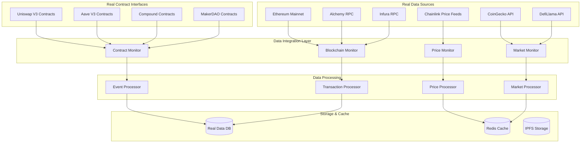

# Real Data Integration - Design Document

## Overview

The Real Data Integration feature transforms the existing crypto credit scoring system from a placeholder-based implementation to a production-ready system that uses authentic blockchain data, real market APIs, and live DeFi protocol interactions. This design provides a comprehensive approach to replacing all mock data sources with verifiable, real-time data from Ethereum mainnet and established market data providers.

### Core Design Philosophy

The architecture follows three fundamental principles:

1. **Authenticity First**: Every data point must be verifiable through blockchain explorers or API documentation
2. **Resilience**: Real-world systems fail, so robust error handling and failover mechanisms are essential
3. **Performance**: Real data comes with latency and rate limits that must be managed efficiently

### System Goals

- Replace all placeholder/mock data with real blockchain and market data
- Implement production-ready API integrations with proper error handling
- Establish reliable real-time monitoring of Ethereum mainnet
- Create verifiable data pipelines that can be independently audited
- Maintain system performance while handling real-world API limitations

## Architecture

### High-Level Real Data Architecture



### Design Decision Rationales

**Multi-Provider Architecture**:
- *Rationale*: Real APIs have downtime, rate limits, and varying reliability. Multiple providers ensure system resilience.
- *Implementation*: Primary/secondary/tertiary provider hierarchy with automatic failover and health monitoring.

**Real-Time WebSocket Integration**:
- *Rationale*: Polling is inefficient for real-time data. WebSockets provide immediate updates for blockchain events.
- *Technical Choice*: Persistent WebSocket connections with automatic reconnection and backfill mechanisms.

**Caching Strategy for Real Data**:
- *Rationale*: Real APIs have rate limits and costs. Intelligent caching reduces API calls while maintaining data freshness.
- *Implementation*: Multi-tier caching with TTL based on data volatility (prices: 30s, transactions: permanent, market data: 5min).

## Components and Interfaces

### 1. Real Blockchain Data Manager

**Purpose**: Manages connections to live Ethereum nodes and fetches authentic blockchain data.

**Core Responsibilities**:
- Establish and maintain WebSocket connections to real Ethereum RPC providers
- Fetch actual transaction data using eth_getTransactionByHash and eth_getTransactionReceipt
- Monitor real blocks and handle chain reorganizations
- Implement failover between multiple RPC providers (Alchemy, Infura, Ankr)

**Key Interfaces**:
```typescript
interface IRealBlockchainManager {
  connectToMainnet(providers: RpcProvider[]): Promise<void>;
  getTransaction(hash: string): Promise<EthereumTransaction>;
  getTransactionReceipt(hash: string): Promise<TransactionReceipt>;
  subscribeToBlocks(callback: (block: Block) => void): Promise<void>;
  subscribeToAddress(address: string, callback: (tx: Transaction) => void): Promise<void>;
  getCurrentBlock(): Promise<number>;
  getBlockByNumber(blockNumber: number): Promise<Block>;
}

interface RpcProvider {
  name: string;
  rpcUrl: string;
  wsUrl: string;
  apiKey: string;
  priority: number;
  rateLimit: number;
  isHealthy: boolean;
}
```

**Real Implementation Details**:
```typescript
class RealBlockchainManager implements IRealBlockchainManager {
  private providers: RpcProvider[] = [
    {
      name: 'Alchemy',
      rpcUrl: 'https://eth-mainnet.alchemyapi.io/v2/',
      wsUrl: 'wss://eth-mainnet.alchemyapi.io/v2/',
      apiKey: process.env.ALCHEMY_API_KEY!,
      priority: 1,
      rateLimit: 300, // requests per second
      isHealthy: true
    },
    {
      name: 'Infura',
      rpcUrl: 'https://mainnet.infura.io/v3/',
      wsUrl: 'wss://mainnet.infura.io/ws/v3/',
      apiKey: process.env.INFURA_API_KEY!,
      priority: 2,
      rateLimit: 100,
      isHealthy: true
    }
  ];
  
  async connectToMainnet(providers: RpcProvider[]): Promise<void> {
    // Real implementation with actual WebSocket connections
    for (const provider of providers.sort((a, b) => a.priority - b.priority)) {
      try {
        const ws = new WebSocket(`${provider.wsUrl}${provider.apiKey}`);
        await this.establishConnection(ws, provider);
        this.currentProvider = provider;
        break;
      } catch (error) {
        console.error(`Failed to connect to ${provider.name}:`, error);
        provider.isHealthy = false;
      }
    }
  }
}
```

### 2. Real Smart Contract Interface Manager

**Purpose**: Interfaces with actual DeFi protocol contracts using real addresses and ABIs.

**Real Contract Addresses**:
```typescript
const REAL_CONTRACT_ADDRESSES = {
  UNISWAP_V3: {
    ROUTER: '0xE592427A0AEce92De3Edee1F18E0157C05861564',
    FACTORY: '0x1F98431c8aD98523631AE4a59f267346ea31F984',
    QUOTER: '0xb27308f9F90D607463bb33eA1BeBb41C27CE5AB6'
  },
  AAVE_V3: {
    POOL: '0x87870Bca3F3fD6335C3F4ce8392D69350B4fA4E2',
    POOL_ADDRESS_PROVIDER: '0x2f39d218133AFaB8F2B819B1066c7E434Ad94E9e',
    ORACLE: '0x54586bE62E3c3580375aE3723C145253060Ca0C2'
  },
  COMPOUND: {
    COMPTROLLER: '0x3d9819210A31b4961b30EF54bE2aeD79B9c9Cd3B',
    COMP_TOKEN: '0xc00e94Cb662C3520282E6f5717214004A7f26888'
  },
  CHAINLINK: {
    ETH_USD: '0x5f4eC3Df9cbd43714FE2740f5E3616155c5b8419',
    BTC_USD: '0xF4030086522a5bEEa4988F8cA5B36dbC97BeE88c'
  }
};
```

**Real Contract Interaction**:
```typescript
interface IRealContractManager {
  getUniswapPoolInfo(poolAddress: string): Promise<PoolInfo>;
  getAaveLendingData(userAddress: string): Promise<LendingPosition[]>;
  getCompoundPositions(userAddress: string): Promise<CompoundPosition[]>;
  getChainlinkPrice(feedAddress: string): Promise<PriceData>;
  decodeTransactionData(txData: string, contractAddress: string): Promise<DecodedTransaction>;
}

class RealContractManager implements IRealContractManager {
  private web3: Web3;
  private contracts: Map<string, Contract> = new Map();
  
  constructor(provider: string) {
    this.web3 = new Web3(provider);
    this.initializeContracts();
  }
  
  private async initializeContracts(): Promise<void> {
    // Load real ABIs and create contract instances
    const uniswapRouterABI = await this.loadABI('uniswap-v3-router');
    const aavePoolABI = await this.loadABI('aave-v3-pool');
    
    this.contracts.set('UNISWAP_ROUTER', new this.web3.eth.Contract(
      uniswapRouterABI,
      REAL_CONTRACT_ADDRESSES.UNISWAP_V3.ROUTER
    ));
    
    this.contracts.set('AAVE_POOL', new this.web3.eth.Contract(
      aavePoolABI,
      REAL_CONTRACT_ADDRESSES.AAVE_V3.POOL
    ));
  }
  
  async getChainlinkPrice(feedAddress: string): Promise<PriceData> {
    const priceFeed = this.contracts.get('CHAINLINK_' + feedAddress);
    const roundData = await priceFeed.methods.latestRoundData().call();
    
    return {
      price: roundData.answer,
      timestamp: roundData.updatedAt,
      roundId: roundData.roundId,
      decimals: await priceFeed.methods.decimals().call()
    };
  }
}
```

### 3. Real Market Data Integration Service

**Purpose**: Fetches authentic market data from established APIs instead of using mock data.

**Real API Integrations**:
```typescript
interface IRealMarketDataService {
  getCoinGeckoPrice(coinId: string): Promise<PriceData>;
  getDefiLlamaTVL(protocol: string): Promise<TVLData>;
  getFearGreedIndex(): Promise<SentimentData>;
  getProtocolYields(protocol: string): Promise<YieldData>;
  getHistoricalPrices(coinId: string, days: number): Promise<HistoricalPrice[]>;
}

class RealMarketDataService implements IRealMarketDataService {
  private readonly COINGECKO_API = 'https://api.coingecko.com/api/v3';
  private readonly DEFILLAMA_API = 'https://api.llama.fi';
  private readonly FEAR_GREED_API = 'https://api.alternative.me/fng/';
  
  async getCoinGeckoPrice(coinId: string): Promise<PriceData> {
    const response = await fetch(
      `${this.COINGECKO_API}/simple/price?ids=${coinId}&vs_currencies=usd&include_24hr_change=true&include_last_updated_at=true`,
      {
        headers: {
          'X-CG-Demo-API-Key': process.env.COINGECKO_API_KEY!
        }
      }
    );
    
    if (!response.ok) {
      throw new Error(`CoinGecko API error: ${response.status}`);
    }
    
    const data = await response.json();
    return {
      price: data[coinId].usd,
      change24h: data[coinId].usd_24h_change,
      lastUpdated: data[coinId].last_updated_at
    };
  }
  
  async getDefiLlamaTVL(protocol: string): Promise<TVLData> {
    const response = await fetch(`${this.DEFILLAMA_API}/protocol/${protocol}`);
    
    if (!response.ok) {
      throw new Error(`DefiLlama API error: ${response.status}`);
    }
    
    const data = await response.json();
    return {
      tvl: data.tvl[data.tvl.length - 1].totalLiquidityUSD,
      change24h: data.change_1d,
      chains: data.chains,
      category: data.category
    };
  }
}
```

### 4. Real Transaction Analysis Engine

**Purpose**: Analyzes actual blockchain transactions instead of simulated data.

**Real Transaction Processing**:
```typescript
interface IRealTransactionAnalyzer {
  analyzeTransaction(txHash: string): Promise<TransactionAnalysis>;
  categorizeRealTransaction(tx: Transaction): Promise<TransactionCategory>;
  calculateRealRiskScore(tx: Transaction): Promise<number>;
  extractProtocolInteractions(tx: Transaction): Promise<ProtocolInteraction[]>;
}

class RealTransactionAnalyzer implements IRealTransactionAnalyzer {
  async analyzeTransaction(txHash: string): Promise<TransactionAnalysis> {
    // Fetch real transaction data
    const tx = await this.blockchainManager.getTransaction(txHash);
    const receipt = await this.blockchainManager.getTransactionReceipt(txHash);
    
    // Decode real method calls
    const decodedData = await this.contractManager.decodeTransactionData(
      tx.input,
      tx.to
    );
    
    // Analyze real gas usage patterns
    const gasAnalysis = this.analyzeGasUsage(tx.gasUsed, tx.gasPrice);
    
    // Extract real protocol interactions
    const protocolInteractions = await this.extractProtocolInteractions(tx);
    
    // Calculate real risk score based on actual data
    const riskScore = await this.calculateRealRiskScore(tx);
    
    return {
      hash: txHash,
      blockNumber: tx.blockNumber,
      timestamp: await this.getBlockTimestamp(tx.blockNumber),
      from: tx.from,
      to: tx.to,
      value: tx.value,
      gasUsed: tx.gasUsed,
      gasPrice: tx.gasPrice,
      decodedData,
      gasAnalysis,
      protocolInteractions,
      riskScore,
      category: await this.categorizeRealTransaction(tx)
    };
  }
  
  async calculateRealRiskScore(tx: Transaction): Promise<number> {
    let riskScore = 0;
    
    // Analyze real gas price (high gas = potential MEV/arbitrage)
    const avgGasPrice = await this.getAverageGasPrice();
    if (tx.gasPrice > avgGasPrice * 2) {
      riskScore += 0.2;
    }
    
    // Check against real blacklisted addresses
    const isBlacklisted = await this.checkBlacklistStatus(tx.to);
    if (isBlacklisted) {
      riskScore += 0.8;
    }
    
    // Analyze real transaction patterns
    const userHistory = await this.getUserTransactionHistory(tx.from);
    const patternRisk = this.analyzeTransactionPatterns(userHistory);
    riskScore += patternRisk;
    
    return Math.min(1, riskScore);
  }
}
```

### 5. Real-Time Price Feed Manager

**Purpose**: Manages live price feeds from Chainlink and other real sources.

**Live Price Integration**:
```typescript
interface IRealPriceFeedManager {
  getChainlinkPrice(asset: string): Promise<PriceData>;
  subscribeToRealPriceUpdates(asset: string, callback: (price: PriceData) => void): Promise<void>;
  getHistoricalPrices(asset: string, fromTimestamp: number): Promise<HistoricalPrice[]>;
  convertToUSD(amount: string, asset: string): Promise<string>;
}

class RealPriceFeedManager implements IRealPriceFeedManager {
  private priceFeeds: Map<string, string> = new Map([
    ['ETH', REAL_CONTRACT_ADDRESSES.CHAINLINK.ETH_USD],
    ['BTC', REAL_CONTRACT_ADDRESSES.CHAINLINK.BTC_USD]
  ]);
  
  async getChainlinkPrice(asset: string): Promise<PriceData> {
    const feedAddress = this.priceFeeds.get(asset);
    if (!feedAddress) {
      throw new Error(`No price feed available for ${asset}`);
    }
    
    return await this.contractManager.getChainlinkPrice(feedAddress);
  }
  
  async subscribeToRealPriceUpdates(
    asset: string, 
    callback: (price: PriceData) => void
  ): Promise<void> {
    const feedAddress = this.priceFeeds.get(asset);
    if (!feedAddress) {
      throw new Error(`No price feed available for ${asset}`);
    }
    
    // Subscribe to real Chainlink price feed events
    const priceFeed = await this.contractManager.getContract(feedAddress);
    
    priceFeed.events.AnswerUpdated({})
      .on('data', async (event) => {
        const priceData = await this.getChainlinkPrice(asset);
        callback(priceData);
      })
      .on('error', (error) => {
        console.error(`Price feed subscription error for ${asset}:`, error);
      });
  }
}
```

## Data Models

### Real Blockchain Data Models

```typescript
interface RealTransaction {
  hash: string;
  blockNumber: number;
  blockHash: string;
  transactionIndex: number;
  from: string;
  to: string;
  value: string;
  gasPrice: string;
  gasUsed: string;
  gasLimit: string;
  input: string;
  nonce: number;
  timestamp: number;
  confirmations: number;
  status: 'success' | 'failed';
  logs: EventLog[];
}

interface RealPriceData {
  asset: string;
  price: string;
  decimals: number;
  timestamp: number;
  source: 'chainlink' | 'coingecko' | 'defillama';
  roundId?: string;
  confidence: number;
  staleness: number; // seconds since last update
}

interface RealProtocolData {
  protocol: string;
  contractAddress: string;
  tvl: string;
  volume24h: string;
  users24h: number;
  apy: number;
  utilization: number;
  lastUpdated: number;
  source: string;
}
```

### Real Market Context Models

```typescript
interface RealMarketContext {
  timestamp: number;
  ethPrice: RealPriceData;
  volatilityIndex: number; // Calculated from real price data
  fearGreedIndex: number; // From Fear & Greed API
  totalTVL: string; // From DefiLlama
  gasPrice: {
    slow: string;
    standard: string;
    fast: string;
    instant: string;
  };
  blockNumber: number;
  networkCongestion: number; // Based on real gas prices
}
```

## Error Handling

### Real-World Error Management

**1. API Rate Limiting**:
```typescript
class RateLimitManager {
  private limits: Map<string, RateLimit> = new Map();
  
  async executeWithRateLimit<T>(
    provider: string,
    operation: () => Promise<T>
  ): Promise<T> {
    const limit = this.limits.get(provider);
    
    if (limit && limit.remaining <= 0) {
      const waitTime = limit.resetTime - Date.now();
      if (waitTime > 0) {
        await this.delay(waitTime);
      }
    }
    
    try {
      const result = await operation();
      this.updateRateLimit(provider, response.headers);
      return result;
    } catch (error) {
      if (error.status === 429) {
        // Handle real rate limit exceeded
        await this.handleRateLimitExceeded(provider, error);
        return this.executeWithRateLimit(provider, operation);
      }
      throw error;
    }
  }
}
```

**2. Blockchain Connection Failures**:
```typescript
class BlockchainFailoverManager {
  async executeWithFailover<T>(
    operation: (provider: RpcProvider) => Promise<T>
  ): Promise<T> {
    const providers = this.getHealthyProviders();
    
    for (const provider of providers) {
      try {
        const result = await operation(provider);
        this.markProviderHealthy(provider);
        return result;
      } catch (error) {
        console.error(`Provider ${provider.name} failed:`, error);
        this.markProviderUnhealthy(provider);
        
        if (this.isLastProvider(provider, providers)) {
          throw new Error('All blockchain providers failed');
        }
      }
    }
    
    throw new Error('No healthy providers available');
  }
}
```

**3. Data Staleness Detection**:
```typescript
class DataFreshnessManager {
  checkDataFreshness(data: any, maxAge: number): DataFreshnessResult {
    const age = Date.now() - data.timestamp;
    
    if (age > maxAge) {
      return {
        isStale: true,
        age,
        maxAge,
        staleness: age / maxAge,
        recommendation: age > maxAge * 2 ? 'reject' : 'use_with_warning'
      };
    }
    
    return {
      isStale: false,
      age,
      maxAge,
      staleness: 0,
      recommendation: 'use'
    };
  }
}
```

## Deployment Strategy

### Real Data Integration Deployment

**1. Environment Configuration**:
- Set up real API keys for Alchemy, Infura, CoinGecko, and other services
- Configure production-ready RPC endpoints and WebSocket connections
- Implement proper secret management for API keys and sensitive configuration

**2. Gradual Migration Approach**:
- Replace placeholder data sources one component at a time
- Implement feature flags to switch between mock and real data during migration
- Monitor system performance and error rates during the transition

**3. Production Monitoring**:
- Set up real-time monitoring for API response times and error rates
- Implement alerting for blockchain connection failures and data staleness
- Create dashboards for tracking real data ingestion and processing metrics

This design provides a comprehensive foundation for transforming the system from placeholder data to real data integration while maintaining reliability, performance, and error resilience in production environments.